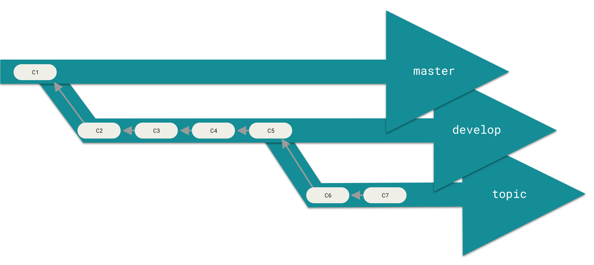
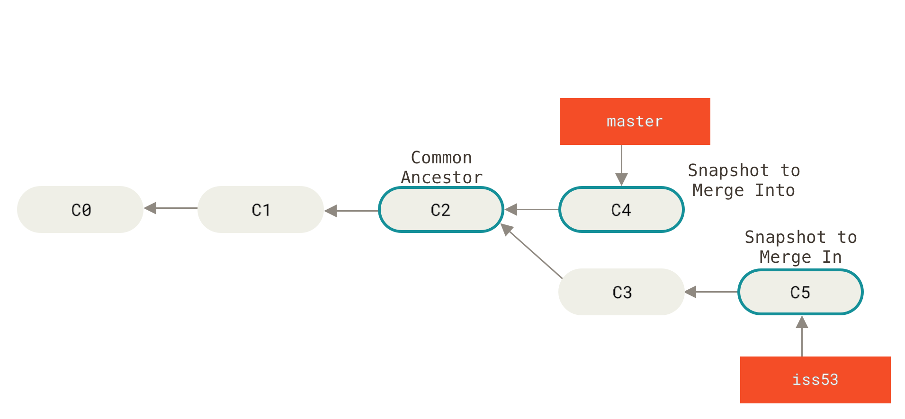

# Git tutorial: a quick Git overview

Authors: Fabien BONNEVAL and Maël FEURGARD

Figures and base material are taken from *The Pro Git* book, by Scott CHACON and Ben STRAUB, available at <https://git-scm.com/book/en/v2>.

-----

In this tutorial we will give you the basics of Git, one of the most popular Version Control System. We will provide a brief overview of its core principles, then teach you how to use the most common commands.

## What is Git ?

Git is a Version Control System (VCS), that is a system able to maintain different versions of a *repository* (a collection of files). It is useful as it tracks safely and efficiently the different changes you can do to whatever project you are working on, regardless of its nature (code, report, slides...).

When you initialize Git on a folder you want to track, it will create a hidden `.git` directory: the *repository*. This is where all changes and history will be saved; on **your** computer. Since Git is very popular, there exist many online services which can save a copy of your *repository* on a *remote* server. The main ones are [Github](https://github.com/), [Gitlab](https://about.gitlab.com/) and [Bitbucket](https://bitbucket.org/). For this tutorial, we will use the first one

## Changes, commits and repository

At its core, Git consider three areas:

- The *Working directory*, where you do your stuff, change files, correct mistakes...
- The `.git` directory, called *repository*, where all data and history is saved as *commits*
- The *staging area*, a buffer between the two where you can *add* your changes before *committing* them, saving the changes in the *repository*

Your main work loop with Git will be to write modifications, *stage* them once they make a (somewhat) functional/coherent change, and finally *commit* them to be saved in the *repository*. If you make a mistake or break something, you will be able to revert by looking at the *repository*, as long as you commit changes often enough...

(To *Check out* means for Git to set your working directory to one of the states recorded in the repository.)

## Branches

One core feature of Git is its ability to handles *branches*: different states of the same folder. The point of handling different states is that you can make a hierarchy of them. Typically, a *master* or *main* branch is kept for fully functional/finished states; a *dev* or *develop* is used for what is mostly done but needs some revisions or adjustments; and finally, other branches are for building new stuff which will eventually be integrated.

Note that this is also helpful when working with other persons: each can work on its branch until he is satisfied with its content, then *merge* it with the reference one.

